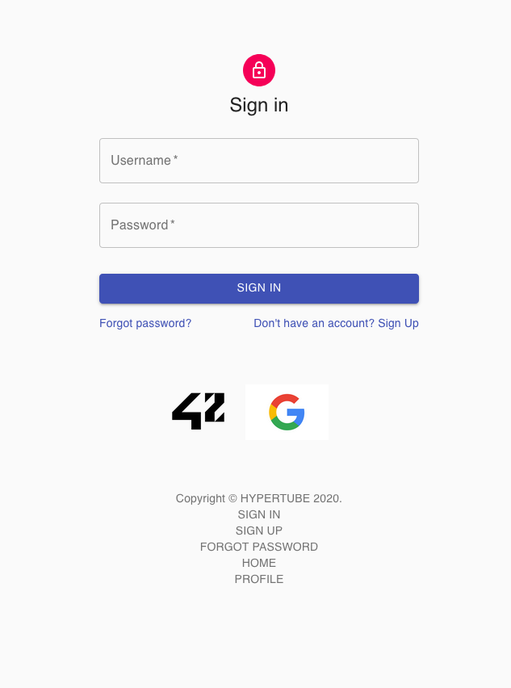
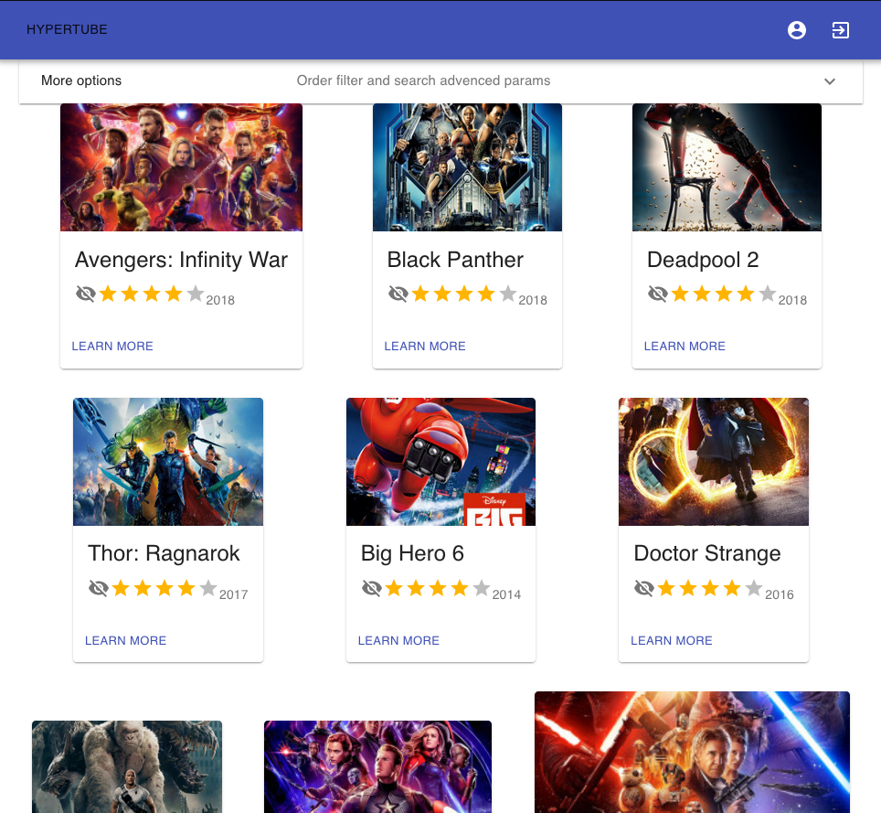
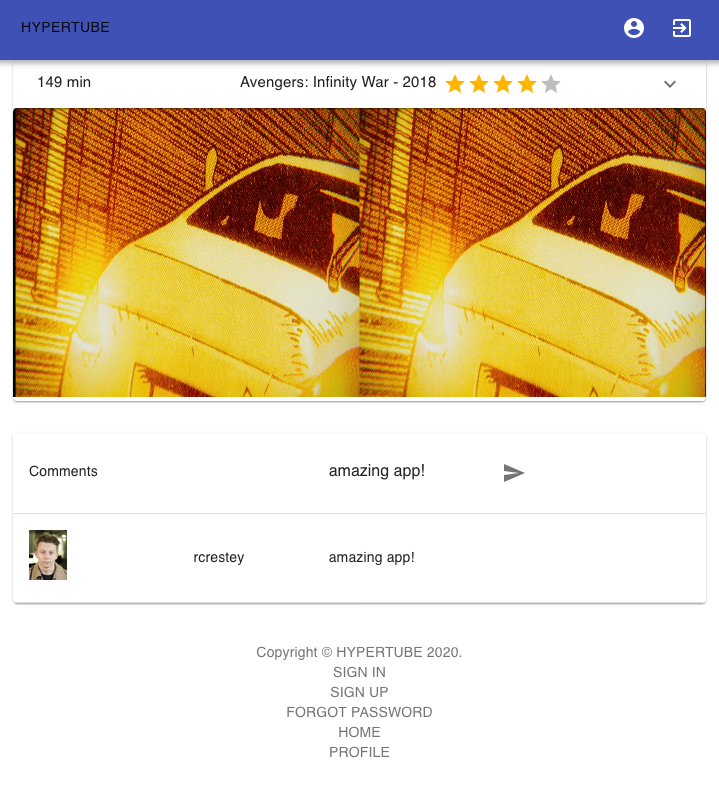
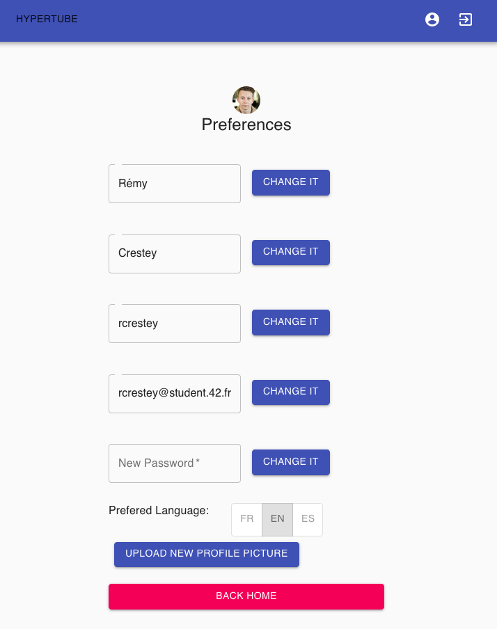
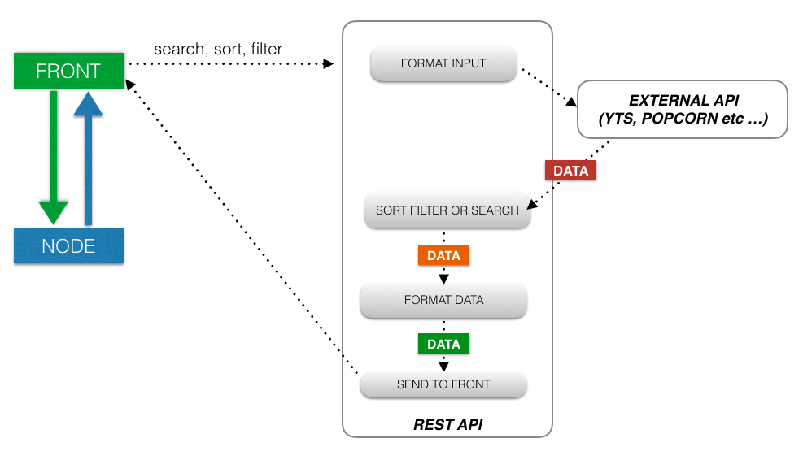
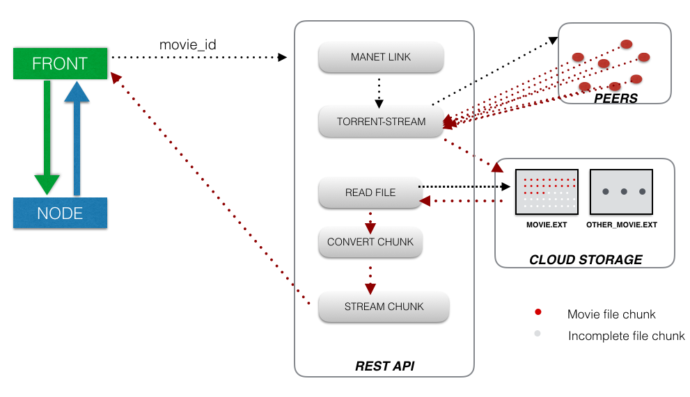
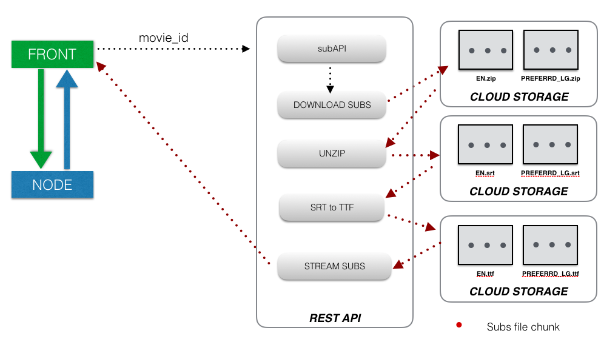

# HYPERTUBE

### SUMMARY

- [Introduction](#introduction)
- [Previews](#previews)
- [Installation](#installation)
	- [1 - Front](#1---front)
	- [2 - Back](#2---back)
- [Stack](#stack)
- [Project Subject](#project-subject)
- [How it's work ?](#so-cool-but-how-its-work-)
	- [1 - users](#1---users) 
	- [2 - Library](#2---library)
	- [3 - Movies](#3---movie)
- [Project Constraints](#project-constraints)
- [Subject Details User Part](#subject-details-user-part)
- [Subject Details Library Part](#subject-details-library-part)
- [Subject Details User Movie](#subject-details-movie-part)
- [Front "Pages" list](#front-pages-list)
- [API Routes list](#api-routes-list)
- [Ending](#ending)

### INTRODUCTION
**Third** and **last** project of the 42 school **web branch.**

This project proposes to create a **web application** that allows the user to **research** and **watch** movie like **Netflix**.

The player will be directly integrated to the site, and the videos will be downloaded through the **BitTorrent** protocol.

The research engine will interrogate external sources. (yts, popcorn, etc)

Once the element selected, it will be **downloaded** from the **server** and **streamed** on the web player **at the same time.** Which means that the **player** won’t only show the video once the download is completed, but **will be able to stream directly the video feed.**

To realize this project, I build a **REST API** with **express**, **postgres**, and many **pl/pgsql functions** in **1 week.**
This project has been thinking for 4 students, but for some reasons, I had no other choice that **does it alone.**

I **knew nothing** about front-end, so **I learned**.
I have chosen **react**, I worked 15h/days, as usual, and in 2 days of works, tutorials, and many many try, I had the react fundamentals.

I used **material-ui** , and at the end of the week, the front was finished.

I took the third week to **test all**, fixed many things on front, and assured myself, that I will validate this project in my first try (that i do).

So I'm proud to introduce you this project, who prove to anyone that said "**it's impossible**", that **it's possible**; 
and that's **the key of our century**, is not what you know right now, but **your capacity to see exactly what knowledge you need** and **to get it much faster as it's possible.**

Because I don't know anyone else that created a free Netflix for his third web project of web learning witch zero knowledge before.

## PREVIEWS

## INSTALLATION
#### 1 - FRONT
- PROD
    - Packages installation:	`npm i`
    - Build static files:		 `npm run build`
    - Run server:			 `npx sirv-cli start build -c -H <HOST> -p <PORT> -s`
- DEV
    - Packages installation: `npm i`
    - start server: `npm start`
/!\ Don't forget to update `src/constant.js` who contains front and back location ;)

#### 2 - BACK
- SET UP `.env` file: You can change all the conf, but here the minimum:

	
- PROD:
    -  `docker-compose up`
- DEV:
    - run database `docker-compose up database`
    - run cloud `docker-compose up cloud`
    - run dev server `npm start`

## STACK
##### FRONT-END:
- react
- react-dom
- material-ui

##### BACK-END:
- express.js
- typescript
- postgres (with pl/pgsql functions)
- Docker

## PROJECT SUBJECT 
This project is composed of **3 main parts**: 
- **Users** (sign-in, sign-up, forgotten password, preferences ...)
- **Library** (Suggest movies, sort, filter and search by name, rating, years...)
- **Movies** (Show all info about movies, the player of course, and comments part)

More details: check the complete subject [here](https://cdn.intra.42.fr/pdf/pdf/3671/hypertube.fr.pdf)

## SO COOL, BUT HOW IT'S WORK ?

Let's see together the main working of each part!
By the end will can, check the code yourself for more precision and a deeper understanding of the internal working ;)

### 1 - USERS

This part is having a really basic working: The **front** check all inputs, call the API routes, check responses and show a toast success/fail message.
**API routes**,  get information, check format and many others things and call the appropriate Pl/pgsql functions, who do specific CRUD action on the DB.

### 2 - LIBRARY

This part is about **scrapping** info.
The front proposes to **set up criteria** like, search, filter (by rating, by production years, by gender, by name ...) and sort (rating, productions year et c...).
Once params are set, **the front calls the API** by sending it this criteria, and the **API route** will **scraps** all information, and then will **returns a table of movies** containing cover, name, year, rating and many other information about films following input criteria !

This API route fetches *yts* API, select, order, and format the response following input criteria sent by the front.

### 3 - MOVIE

This the **most complex part**, which contains itself **3 sub part.**
First, I need to **get all information** about the watched movie (casting, productions, director, .... etc etc) -> Easy

Second, I nee to have **comments part** -> Easy

And third, I need to **download the movie from torrent**, and at the same times, **get subtitles of it** in English, and preferred language of the user, and steam all the content to the front -> Not soo esay

For the firs and the second part, its basic **CRUD** like USER part, so you can check the code by yourself, but **no explanations needed**.

So first, how to **stream a torrent** without libs that do the stuff ?
First step is to **download the file**, second step is to **stream the file** (but **at the same** time that is downloaded, of course).

So how I do that ?
First, the user click on a movie that he wants to see.
I get the **IMDB code** of the movie, then I **generate the magnet link** (for torrent).
So the next step is to **download the movie asynchronously,** in "**right order**", cause, maybe you take care of it, but normally, when you download a movie by torrent, the file is split of many pieces, and the torrent client download randomly the pieces.

Here I can't do like that, I need to download pieces of the file in the right order, and send it the firsts pieces in the front player and at the same time I will download the next pieces, you see what I mean?

For doing that, I use ** torrent-stream **, we give it the generated magnet link, and he download the file from torrent with the right order the pieces!

So we are doing that asynchronously, and by the same time, I created a function who **finds the movie file in the folders,** and another who **streams this file to the front**. (Many tutorials are available everywhere for doing that, the difficulty, is doing both in the same time!).
Just a thing: before streaming, the movie, I need to **check the file format**, and if it's not nativly supported by browser, I **convert it asynchronously** thank to **ffmpeg** lib between the download and stream parts !

So you can check the code by yourself, or contact me if you're most interested, but I stay in general process here ;)

So the last part is **about subtitles**! (more complex that we can imagine).
First, with the **IMDB code** of the movie, I **download the right subtitles** that I needed thanks to subAPI, I get some **ZIP files** for each subtitles that I’ had downloaded (for each language that I want), then I created a function who **unzip this files.**

So here we have `.str` files.
But the things (really boring) is that `.str` **isn’t a native format** for browser (‘Oh fuck…’ that I said myself when i seen that).

So the solution is **to convert** the file in `.ttf` asynchronously and stream it to the front like the video process !

More simple to say that to do, but it’s possible, and when you do it, it become easier.

As before, you can check the code by yourself, for more details and more understanding !

So here is the main process of the app ! I hop that you understood well my explanations !
If you want more, just ask me ;)

## PROJECT CONSTRAINTS:
- For this project you are free to use **any language you choose**.
-  All the framework, micro-framework, libraries etc. . . are authorized within **the limits** where they are **not used to create a video stream from a torrent**, thus limiting the educational purpose of this project. For example, libraries such as **webtorrent, pulsar and peerflix are forbidden.**
- You are free to use **the server of your choice**, may it be Apache, Nginx ou même un built-in web server.
- Your whole application will have to be at minimum compatible with **Firefox (>= 41) and Chrome (>= 46).**
- Your website must have a decent layout: at least a header, a main section and a footer.
- Your website must be **usable on a mobile** phone and keep an acceptable layout on small resolutions.
- All your **forms** must have **correct validations** and the **whole website must be secure**. This part is mandatory and will be checked extensively in defense. To give you an idea, here are a few elements that are not considered secure:
    - To have a “plain text” password stored in your database.
    -To be able to inject HTML of “user” Javascript code in unprotected variables. 
    - To be able to upload unwanted content.
    - To be able to alter a SQL request.

More details: check the complete subject [here]()

## SUBJECT DETAILS USER PART

-   The app must allow a user to register asking at least an email address, a username, a last name, a first name and a password that is somehow protected.
    
-   The user must be able to register and connect via Omniauth. You must then implement at least 2 strategies: the 42 strategy and another one of your choice.
    
-   The user must then be able to connect with his/her username and password. He/She must be able to receive an email allowing him/her to re-initialize his/her password should the first one be forgotten.
    
-   The user must be able to disconnect with 1 click from any pages on the site.
    
-   The user must be able to select a preferred language that will be English by default.
    
    A user will also be able to:
    
    -   Modify the email address, profile picture and information.
        
    -   Consult the profile of any other user, ie see the profile picture and information. The email address however will remain private.

## SUBJECT DETAILS LIBRARY PART
This part will have at minimum: 
- A research field.
- A thumbnails list. 

### Research
The search engine will interrogate at least two external sources of your choice, 1, and return the ensemble of results in thumbnails forms.

You will limit the research to videos only.

### Thumbnails

If a research has been done, the results will show as thumbnails sorted by names.

If no research was done, you will show the most popular medias from your external sources, sorted as per the criteria of your choice (downloads, peers, seeders, etc...).

In addition to the name of the video, a thumbnail must be composed, if available, of its production year, its IMDb note and a cover image.

You will differentiate the videos watched from unwatched, as you prefer.

The list will be paginated, at the end of each page. The following one must be auto- matically charged asynchronically. That means there cannot be a link from each page.

The page will be sortable and filtered according to criteria such as name, genre, the IMDb grade, the gap of production year etc..

## SUBJECT DETAILS MOVIE PART

This section will present the details of a video, ie show the player of the video as well as – if available - the summary, casting (at least producer, director, main cast etc...) the production year, length, IMDb grade, a cover story and anything you think relevant.

You will also give the users the option of leaving a comment on the video, and show the list of prior comments.

To launch the video on the server we must - if the file wasn’t downloaded prior – launch the download from the associated torrent on the server, and stream the video flux from that one as soon as enough data has been downloaded to ensure a seamless watching of the video. Of course, any treatment must be done in the background in a non-blocking manner.

Once the movie is entirely downloaded, it must be saved on the server, so that we don’t need to re-download the movie again. If a movie is unwatched for a month, it will have to be erased.

If English subtitles are available for this video, they will need to be downloaded and available for the video player. In addition, if the language of the video does not match the preferred language of the user, and some subtitles are available for this video, they will need to be downloaded and selectable as well.

If the video is not natively readable for the browser 2, you will convert it on the fly in an acceptable format. The mkv support is a minimum.

## FRONT PAGES LIST
Pages are in `src/pages` of the front folders, and the routes in `src/app` file ;)

- `/sign-in`
- `/sign-in/:uuid/:token` ( Email verification link)
- `/sign-up`
- `/password-reset` (When user forgot his password)
- `/` ( Home library )
- `/user/:uuid` ( External user profile)
- `/film/:id` ( Movie part, with film id)
- `/preferences` ( Users preferences)

## API ROUTES LIST
- USERS LOGIN
	- `/auth/login` (POST) 
- USERS OAUTH
	- `/auth/42` (GET)
	- `/auth/google` (GET)
- USER REGISTRATION
	- `/user/registration` (POST)
	- `/user/registration/activate/:uuid/:token` (GET)
	
- USER - PASSWORD RESET 
	- `/user/reset` (POST) 
	- `/user/reset/activate/:uuid/:token` (GET)
- USER - EDITION (user need to be connected for the following routes)
	- `/user/changing/photo` (POST)
	- `/user/changing/username` (POST)
	- `/user/changing/email` (POST)
	- `/user/changing/givenname` (POST)
	- `/user/changing/familyname` (POST)
	- `/user/changing/preferredlg` (POST)
- USER - GET PROFILE
	- `/user/external/:uuid` (GET)

- HOME (SEARCH AND SUGGESTS) 
	- `/home/:page/:limit` (POST)
- MOVIE
	- `/movie/information/:id'` (GET) -> get all info about a movie
	- `/movie/comments/:id` (GET) ->  get all comments about a movie
	- `/movie/comments/:id` (POST) -> Post a comment for a movie
	- `/movie/:id` (GET) -> Get Stream of a movie !!! 
	- `/movie/sub/:imdbId` (GET) -> Get sub of a movie !
	- `/movie/isee/:id` (GET)

You can find my complete documentation [here](https://docs.google.com/spreadsheets/d/16shAMxLjN4dgDYkWHk6zwCf9ZBJNZvn8P89CuaEHsuE/edit?usp=sharing) ;)

## ENDING

Thanks for your interest.
Contact me if you have questions, or if want to talk about that !
See you ;)
